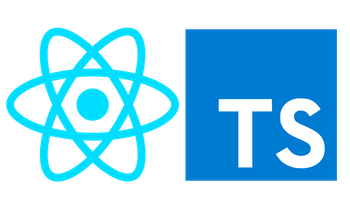

# React with Typescript



Repository used during React workshop at @TalanLabs

## Requirements

* node (last LTS)
* npx (bundled with npm 5.2+)
* typescript 4+


## Exercices

* [Javascript](0_javascript/exercice.md)
* [Typescript](1_Typescript/exercice.md)
* [React TS setup](2_react_install/exercice.md)
* [React TS props](3_react_props/exercice.md)
* [React TS state](4_react_state/exercice.md)


## Use REPL for exercices

### Node

```
node myfile.js
```


### Typescript


Install ts node

```
# Locally in your project.
npm install -D typescript
npm install -D ts-node

# Or globally with TypeScript.
npm install -g typescript
npm install -g ts-node
```

```
ts-node myfile.ts
```

